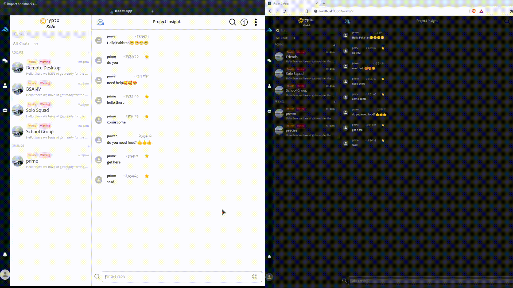

    
    
    
    

# LetsChat

🚀 Discover the chat of tomorrow! 🔥 Our React and GraphQL-driven app delivers real-time magic ⚡️, connecting you with friends effortlessly. With WebSockets, messages arrive instantly 📩. Say goodbye to lag, hello to an extraordinary chatting experience! 🌟

### Features

### Getting Started

Currently under work
